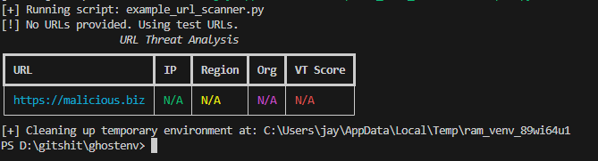

RAM Drive + VENV loader for python scripts, stealth environment with full isolation 

# Usage
py ghostenv.py run script_path.py requirements_path.txt -- args...

## Image Showcase

Here is an example of the workflow:

